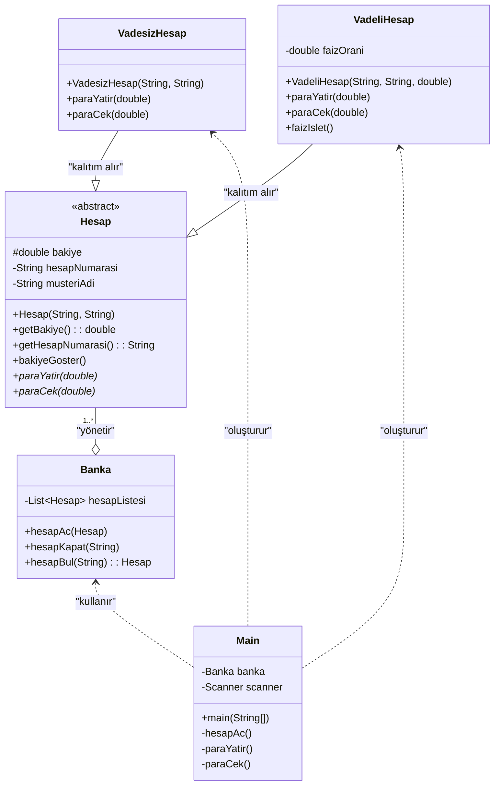

# Basit Banka Simülasyonu (OOP)

Java ve Nesne Yönelimli Programlama (OOP) prensipleri kullanılarak geliştirilmiş bir konsol (CLI) tabanlı banka yönetim uygulaması.

Bu proje, OOP'nin dört temel direği olan **Soyutlama**, **Kalıtım**, **Çok Biçimlilik** ve **Kapsülleme** konularını pratik bir senaryo üzerinden göstermek amacıyla tasarlanmıştır.

## 📌 İçindekiler

  * [Proje Hakkında](#-proje-hakkında)
  * [Temel Özellikler](#-temel-özellikler)
  * [UML Sınıf Diyagramı](#-uml-sınıf-diyagramı)
  * [Gösterilen OOP Konseptleri](#-gösterilen-oop-konseptleri)
  * [Kullanılan Teknolojiler](#-kullanılan-teknolojiler)
  * [Kurulum ve Çalıştırma](#-kurulum-ve-çalıştırma)
  * [Lisans](#-lisans)

## 🚀 Proje Hakkında

Bu simülasyon, kullanıcıların vadesiz ve vadeli olmak üzere iki farklı türde banka hesabı açmasına, bu hesaplara para yatırıp çekmesine ve bakiye görüntülemesine olanak tanır. Vadeli hesaplara özel faiz işletme fonksiyonu da mevcuttur.

Projenin ana amacı, teorik OOP bilgilerini somut bir projeye dökmektir.

## ✨ Temel Özellikler

  * **Yeni Hesap Aç:** Vadesiz veya Vadeli hesap oluşturma.
  * **Para Yatır:** Seçilen hesaba bakiye ekleme.
  * **Para Çek:** Seçilen hesaptan bakiye eksiltme (bakiye kontrolü ile).
  * **Bakiye Görüntüle:** Hesap detaylarını ve mevcut bakiyeyi listeleme.
  * **Hesap Kapat:** Bakiyesi 0 olan hesabı sistemden silme.
  * **Faiz İşlet:** Sadece vadeli hesaplara özel, tanımlı oran üzerinden faiz geliri ekleme.

## 📊 UML Sınıf Diyagramı

Projenin sınıf yapısı ve ilişkileri aşağıdaki diyagramda özetlenmiştir.



## 🧠 Gösterilen OOP Konseptleri

1.  **Soyutlama (Abstraction):**

      * `Hesap.java` sınıfı `abstract` olarak tanımlanmıştır.
      * `paraYatir` ve `paraCek` metotları, tüm alt sınıfların zorunlu olarak üzerine yazması (override) gereken `abstract` metotlardır.

2.  **Kalıtım (Inheritance):**

      * `VadesizHesap.java` ve `VadeliHesap.java` sınıfları, `Hesap` sınıfının tüm ortak özelliklerini (`bakiye`, `hesapNumarasi` vb.) `extends` anahtar kelimesi ile miras alır.

3.  **Çok Biçimlilik (Polymorphism):**

      * `Banka.java` sınıfı, farklı türdeki hesap nesnelerini (Vadesiz ve Vadeli) tek bir `List<Hesap>` listesinde tutar.
      * `Main.java` içerisinde `hesap.paraCek(miktar)` gibi bir çağrı yapıldığında, o anki nesnenin türüne göre (Vadesiz mi, Vadeli mi) doğru metot otomatik olarak çalıştırılır.

4.  **Kapsülleme (Encapsulation):**

      * `Hesap.java` içindeki `bakiye` (`protected`), `hesapNumarasi` (`private`) gibi alanlar dış dünyaya kapatılmıştır.
      * Bu verilere erişim, sadece `getHesapNumarasi()` veya `paraYatir(miktar)` gibi `public` metotlar aracılığıyla kontrollü bir şekilde sağlanır.

## 💻 Kullanılan Teknolojiler

  * **Java 11** (veya üstü)

## 🛠️ Kurulum ve Çalıştırma

Projeyi yerel makinenizde çalıştırmak için aşağıdaki adımları izleyin:

1.  **Projeyi Klonlayın (veya ZIP olarak indirin):**

    ```sh
    git clone https://[BURAYA_GITHUB_REPO_URL'NIZI_YAPIŞTIRIN].git
    ```

2.  **Proje Dizinine Gidin:**

    ```sh
    cd [PROJE_KLASOR_ADINIZ]
    ```

3.  **Tüm `.java` Dosyalarını Derleyin:**

      * Tüm `.java` dosyalarının aynı dizinde olduğundan emin olun.

    <!-- end list -->

    ```bash
    javac *.java
    ```

4.  **Uygulamayı Çalıştırın:**

      * `Main` sınıfı, programın giriş noktasıdır.

    <!-- end list -->

    ```bash
    java Main
    ```

5.  Ekrandaki menü talimatlarını izleyerek simülasyonu kullanmaya başlayın.

## 📄 Lisans

Bu proje [MIT Lisansı](https://choosealicense.com/licenses/mit/) altında lisanslanmıştır. Detaylar için `LICENSE.md` dosyasına bakabilirsiniz.

